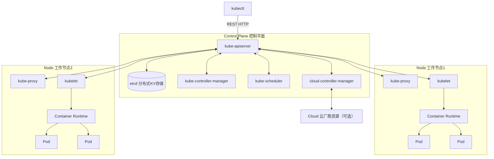
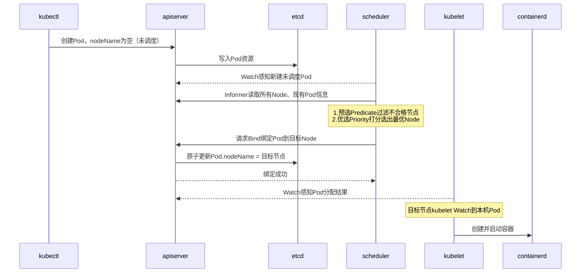
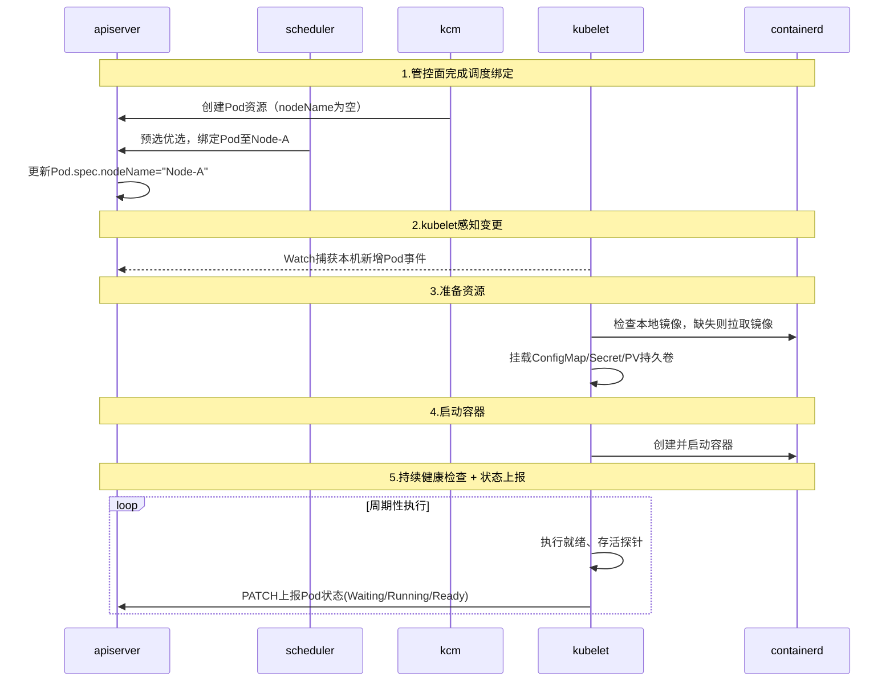

# K8s 核心概念学习笔记
> 学习目标：打通控制平面、工作节点、资源对象完整模型，结合分布式存储管控架构对标理解
> 实战载体：Linux单机 kind 融合集群搭建验证


## 一、集群分层架构（对标 OceanStor FSM/CM + FSA 架构）
### 1. 控制平面 Master 组件合集
#### 1.1 kube-apiserver
- 核心职责:Kubernetes 集群唯一入口网关
  - 集群内所有组件、客户端，所有读写集群资源（Pod/Deployment/Service 等）的操作，只允许和 apiserver 通信，禁止任何组件直连 etcd。
  - 集群唯一可信 API 服务，承载所有 REST 资源操作,接收增删改查（CRUD）各类资源请求；同时提供 Watch 监听机制（分布式系统核心）。
  - 统一完成全套安全管控：认证、鉴权、准入控制。
  - 序列化 / 反序列化资源对象，完成数据校验，合法请求最终持久化存入 etcd。
- 鉴权、准入控制机制
  - 认证 Authentication：确认「你是谁」
  - 鉴权 Authorization：确认「你有没有权限干这件事」
  - 准入控制 Admission Controller：请求写入 etcd 之前的最后一道拦截
- 📝【个人心得/类比】
  - apiserver ≈ 存储管控面统一 HTTP/RPC 网关
  - etcd ≈ 底层配置数据库（CCDB）
  - 上层业务模块（CM/MDC/FSA）不能直连数据库，必须走网关；
  - 网关负责鉴权、参数校验、防止脏数据入库；
  - 网关只提供「业务语义接口」（创建 Pod、扩容副本），不提供「直接修改数据库表 / Key」的底层接口。
#### 1.2 etcd
- 分布式KV存储、Raft协议
  - 持久保存 K8s 全部资源数据（Pod/Deployment/ConfigMap/Secret/Namespace……），集群唯一真实数据源；
  - 提供 强一致读写、MVCC 多版本、事务能力，支撑 apiserver 乐观锁并发控制（resourceVersion）；
  - 提供长连接 Watch 机制，支持客户端订阅 Key 变更（apiserver 依赖它实现集群事件分发）；
  - 依靠 Raft 协议实现多节点副本，保证元数据高可用、不丢失。

- 集群选主、脑裂防护
  - 思想 1：Raft 一致性算法，多数派（Quorum）保障写入安全
  - 思想 2：MVCC 多版本并发控制（乐观锁基础）
  - 思想 3：事件通知机制（Watch）
  - 思想 4：简单分层，聚焦「强一致小型元数据」

- 唯一可信数据源；仅apiserver可直连读写
- 📝【个人心得/类比】
  - etcd 路径只是字符串前缀模拟树形，和 ZK 原生 znode 树形模型本质不同；
  - apiserver 隔离 etcd = CM 网关隔离底层元数据库，同一套分布式管控设计范式；
  - 底层存储实现细节对外屏蔽，上层使用者只操作业务语义资源。

#### 1.3 kube-controller-manager
- 控制器循环调谐模型（期望状态 vs 真实状态）
  - 内部运行一组相互独立的控制器（Controller），所有控制器共享一套与 apiserver 通信的客户端；
  - 每个控制器持续执行 Reconcile（调谐循环）：
    - 从 apiserver 获取【期望状态】（etcd 内保存的蓝图） + 【集群当前真实状态】
    - 计算差值，调用 apiserver API 发起增 / 删 / 改动作，驱动集群向期望状态收敛；
  - 只负责资源管控逻辑，不负责 Pod 调度到哪个节点（调度单独交给 kube-scheduler）；
  - 多 Master 部署场景：依靠 etcd 分布式锁抢主，同一时刻集群只有一份活跃实例，防止多个控制器重复执行操作引发冲突。
- 顶层设计思想
  - 思想 1：期望状态驱动 + 无限循环调谐（整个 K8s 灵魂）
  - 思想 2：控制器职责拆分、单一职责原则
  - 思想 3：无状态设计
  - 思想 4：分布式选主防并发冲突
- 多Master部署：etcd分布式锁抢主机制

- 内置常见控制器简介
- 📝【个人心得/类比】
  - apiserver 作为集群统一数据总线，所有组件状态交互必经此处；依靠 Informer 缓存避免海量重复请求，是集群架构的核心枢纽。
  - 调谐循环表层是循环判断，核心价值是标准化分布式状态收敛模型：不依赖事件、不保存本地状态、具备兜底巡检能力，天然容忍网络抖动、进程重启、意外故障。
  - controller-manager 属于无状态服务，自身不持久化数据；配合 etcd 分布式租约锁完成多实例选主，保证同一时间仅有单一活跃实例执行调度逻辑，避免并发冲突。
  - K8s 控制器基于 client-go 通用框架，采用「Informer 本地缓存 + 工作队列 + 多协程 Worker」模型；框架公共复用，每种控制器独立实现 Reconcile 业务逻辑，Go 语言依靠接口组合而非类继承实现抽象。
  - GMP M:N 调度不是批量阻塞批量释放；IO 阻塞的 G 会和 M 解绑，一旦某个操作系统 M 空闲，立刻承接排队协程，流水线调度；
  - 架构通信划分：海量外部 FSA 客户端南北向流量接入控制总线做收敛；少数 CM 集群内部协商通信采用点对点直连，避免不必要转发延迟；
  - 控制总线划分消息优先级队列，保障集群视图、投票等高优先级指令优先处理；
  - 正常运行场景，总线不会丢弃 FSA 原始心跳报文，依靠本地计时器收敛消息，仅推送状态跃迁事件至 CM；队列溢出丢包属于极端过载降级策略，依托 5s 心跳容错窗口抵御瞬时异常，不作为常规抗风暴方案。
  - K8s 控制平面标准范式：所有管控交互统一经过 kube-apiserver，控制面组件之间不建立点对点 TCP 直连通信；
  - controller-manager、scheduler 选主依靠读写 apiserver 管理的 Lease 租约资源实现，不存在组件之间点对点投票协商；
  - kubelet 节点心跳通过定期 PATCH Lease 对象上报至 apiserver，NodeController 依靠 Watch 感知节点存活状态；相比存储 0.5s 高频心跳场景，K8s 默认心跳周期更长，发生心跳风暴的概率更低；大规模节点集群仍需要做好 apiserver 限流防护；
  - 架构范式区别：存储控制总线偏向「消息转发、流量收敛网关」；apiserver 同时承担统一网关 + 集群唯一状态写入入口，整套系统依靠共享状态 + Watch 事件协同，而非组件之间互发业务消息；
  - 极少数例外：apiserver 主动反向访问 kubelet 获取容器日志；业务 Pod 之间的数据面网络通信，不经过控制平面。
#### 1.4 kube-scheduler
- 核心职责
  - 通过 apiserver Watch 监听所有 未绑定 Node 的 Pod（Pod.spec.nodeName 为空）；
  - 执行一套筛选 + 打分算法，从集群所有 Node 里选出最优节点；
  - 向 apiserver 发起更新请求，把 Pod 绑定到目标 Node（写入 etcd）；
  - 多 Master 部署时，依靠 etcd Lease 租约抢主，同一时间仅一个活跃 scheduler，避免多个调度器争抢同一个 Pod 引发冲突。
- 顶层设计思想
  - 思想 1：两段式调度框架：预选 (Predicate) → 优选 (Priority)
    - 预选：硬性过滤，不满足条件直接淘汰，一票否决；
    - 优选：柔性打分，剩余合格节点计算分数，选出最高分。
    - 先筛掉不能跑的机器，再从能用的机器里挑最合适的。
  - 思想 2：插件化架构
    - 早期：内置一堆硬编码判断；
    - 新版 Scheduler Framework：所有预选、优选逻辑封装成插件，可以启用 / 关闭、自定义扩展。企业场景可以开发自定义调度插件（亲和、反亲和、硬件拓扑、GPU 调度、存储拓扑感知）。
  - 思想 3：无状态设计
    - 自身不缓存长期数据，所有集群视图依靠 Informer 从 apiserver 同步；进程重启后重新 List-Watch 即可恢复调度。
  - 思想 4：抢占机制（高优先级保障）
    - 当高优先级 Pod 没有合适节点可调度时，可以驱逐低优先级 Pod，腾出资源。
    - 类比存储：高优先级业务优先抢占资源。
- Pod绑定调度完整流程

- 预选、优选打分机制
- 📝【个人心得/类比】
  - scheduler 只负责选定节点，不启动容器；决策层和执行层（kubelet）解耦；
  - 两段式「预选过滤 + 优选打分」是通用资源调度经典范式，可以平移到存储、算力平台；
  - Bind 原子绑定防止多个调度器并发争抢同一个 Pod；
  - requests 用于调度预判，limits 用于运行时限流，两者作用需要严格区分；
  - 污点、亲和、抢占机制，实现业务分层、故障域隔离、优先级保障。

#### 1.5 类比感悟
分布式软件架构和社会组织运行逻辑高度同源：
组件拆分对应部门划分，职责解耦换取故障隔离与横向扩展能力；统一网关（apiserver）如同统一公文流转中枢，规避点对点无序通信。
任何分层、拆分都会引入额外开销；适度拆分提升稳定性，过度拆分直接造成架构臃肿、链路冗长。
kubelet 是地方主管，负责执行落地；kube-proxy 如同大厅物业，维护实时花名册，为访问请求提供稳定寻址与流量转发，屏蔽底层实体动态变化。

### 2. 工作节点 Worker 组件
#### 2.1 kubelet（对标FSA节点本地代理）
- 核心职责
  - kubelet 部署在集群每一个 Node 节点，不跨节点调度，视野仅限本机资源。
  - 通过 Watch apiserver，持续监听 绑定到当前节点的 Pod（Pod.spec.nodeName = 当前节点名称）；
  - 对比本机真实运行状态与 etcd 中保存的 Pod 期望规格，持续执行本地调谐循环；
  - 调用容器运行时接口 CRI（containerd）完成容器：拉镜像、创建、启动、停止、删除；
  - 管理存储卷：PV/PVC、ConfigMap、Secret 的挂载与卸载；
  - 周期性执行 存活探针 (livenessProbe)、就绪探针 (readinessProbe)；容器异常无响应则主动重启容器；
  - 采集 Pod、容器状态，持续 PATCH 请求上报给 apiserver，把真实运行状态回填集群；
  - 定时上报节点租约 Lease（节点心跳），让控制平面感知节点是否在线。、
  - 边界重点：kubelet 不会调度 Pod、不会决策扩缩容，没有任何集群层面决策能力，只负责执行。
- 顶层设计思想
  - 思想 1：反向订阅模型，管控面无需主动推送指令
    - kubelet 主动向 apiserver 建立 Watch 长连接；
    - 控制平面不需要保存成千上万节点长连接、不需要主动拨号下发命令。
    - 网络断连后恢复，kubelet 自动重新同步状态，天然容错。
  - 思想 2：无状态持续调和，不依赖单次事件
    - Watch 变更事件是加速器；内置周期性全量巡检兜底。
    - 就算网络抖动丢失事件，下一轮循环依然会对齐期望状态，杜绝永久停滞。
  - 思想 3：决策与执行彻底分离
    - 控制平面（controller/scheduler）负责「规划放哪里、启动多少实例」；
    - kubelet 只负责「本机按照规格落地运行」。
    - 做到管控面横向扩容、节点执行层独立迭代。
  - 思想 4：CRI 标准化，解耦容器运行时
    - kubelet 不直接绑定 docker，通过标准 CRI 接口调用容器引擎；
    - 可以无缝切换 containerd、cri-o 等实现，上层逻辑完全不用改动。
- 内部核心模块拆解
  - Pod Manager：缓存本机所有 Pod 定义，接收 Watch 推送变更，维护目标清单。
  - Image Manager：负责镜像拉取、镜像过期清理、镜像下载限速。
  - Volume Manager：处理持久卷、配置文件卷挂载；Pod 销毁时卸载存储，防止残留。
  - CRI Runtime Manager：和 containerd 交互，执行容器生命周期操作（create/start/stop/delete）。
  - Probe Manager 探针管理器：独立协程循环执行 HTTP/tcp/exec 探针；根据返回结果判断容器健康度。
  - Node Status Manager：上报节点资源信息、节点租约心跳、Pod 运行状态回写给 apiserver。
- 完整时序链路：



- 📝【个人心得/类比】
  - kubelet 是管控面作用到物理机器的唯一抓手，管控面只下发期望状态，不远程操作容器；
  - 依靠 Watch 反向订阅，极大降低控制平面长连接管理压力；
  - CRI 接口隔离容器引擎，上层业务逻辑与底层容器实现解耦；
  - 存活 / 就绪探针实现业务层面自愈，不只是简单监控进程是否存在；
  - 状态闭环：管控面下发目标 → kubelet 执行 → kubelet 回填真实运行状态。
  - 和 Python 迭代协议思想同源，属于「能力契约」：想要启用标准化功能，就需要实现约定的入口。
  - 区别在于：Python 迭代能力一旦触发，缺少魔法方法直接抛出异常；K8s 探针属于可选择开启的机制，不配置则无任何约束；主动开启 HTTP 探针后，业务必须提供对应健康接口，否则触发容器重启。
  - 同时二者都具备鸭子类型特征：只关心外部行为是否符合约定，不关心内部实现语言与细节。

#### 2.2 kube-proxy
- 核心职责
  - 运行在每个 Node 上的网络代理；基于 Service 资源，维护本机内核的负载均衡转发规则（iptables /ipvs）。
  - 通过 Watch apiserver 监听 Service、EndpointSlice 变更；
  - 在当前节点配置内核转发规则；
  - 实现：固定 ClusterIP → 后端一组 Pod 的流量转发、负载均衡；
  - 屏蔽 Pod IP 动态变化，集群内所有节点访问 Service 不需要感知后端 Pod 真实地址。
- 设计思想
  - 分布式网络模型，无中心化网关：没有一台独立的负载均衡中心机器；每台节点独立完成转发。任意 Pod 发起访问，本机内核直接完成路由跳转。
  - 声明式网络配置：期望的转发规则保存在 etcd（Service 定义）；kube-proxy 持续调和本机内核规则，保证现实配置和期望一致。
  - 多种后端模式演进：userspace（淘汰）→ iptables → ipvs（推荐大规模集群）
- 极简工作流程
  - 用户创建 Service，选定一组后端 Pod；信息存入 etcd；
  - kube-proxy Watch 感知 Service、后端 Endpoint 列表变化；
  - 在本机内核添加 / 删除转发规则；
  - 集群内 Pod 访问 Service.ClusterIP:端口，内核根据规则转发至某一个后端 Pod。
- Service网络代理实现模式（iptables / ipvs）
- 集群内部负载均衡原理
- 📝【个人心得/类比】
  - kube-proxy 类似每台大楼独立的通讯处，提前维护好虚拟服务名称与在岗员工工位对照表；访客只需要填写统一虚拟门牌，本机内核自动指路；通讯专员只负责更新表格，不亲自带人跑腿。
  - 区分两大网络组件职责：
    - CNI 保证任意两个 Pod 网络可达；
    - kube-proxy 实现 Service 虚拟地址、负载均衡、屏蔽后端 IP 波动。

### 3. 客户端工具 kubectl & kubeconfig
#### 3.1 kubectl
- 本质：将命令翻译HTTPS请求发送apiserver
  - kubectl 本身不存储任何集群数据，它只是一个 HTTP 客户端；
  - 所有操作最终都会发 HTTPS 请求到 kube-apiserver；
  - 不会直连 etcd，不直接操作节点；严格遵循集群控制面访问模型。
- 通用请求链路：kubectl → 读取kubeconfig → 获取apiserver地址+证书/令牌 → HTTPS请求 → apiserver
- 基础命令范式：kubectl [动作] [资源类型] [名称] [参数]
  - 动作：get/create/delete/apply/edit/describe/logs/exec
  - 资源：pod/deployment/service/node/configmap/namespace
- 📝【个人心得/类比】
  - 管控面了解一下

#### 3.2 kubeconfig
- kubeconfig 是 YAML 格式配置文件，作用：保存 集群地址、认证凭证、上下文信息，让 kubectl 知道：
  - 连哪一个 apiserver（集群）
  - 使用什么身份登录（证书、token、用户名密码）
  - 默认操作哪个命名空间
- 默认路径：~/.kube/config
- 可以通过环境变量 KUBECONFIG 指定多个配置文件。
- kubeconfig 内部三大核心组成
  - 1 clusters集群列表：记录 apiserver HTTPS 地址、集群 CA 根证书，用来校验服务端身份，防止中间人劫持。
```yaml
clusters:
- name: dev-cluster
  cluster:
    server: https://192.168.10.10:6443
    certificate-authority-data: xxx
```
  - 2 users用户凭证:客户端身份：客户端证书 /token。代表 “你是谁”。
```yaml
users:
- name: dev-user
  user:
    client-certificate-data: xxx
    client-key-data: xxx
```
  - 3 contexts上下文（粘合剂）:把「集群 + 用户 + 默认命名空间」三者绑定在一起。
```yaml
contexts:
- name: dev-context
  context:
    cluster: dev-cluster
    user: dev-user
    namespace: default
```
# 二、核心业务资源对象（声明式API核心载体）
> 统一思想：所有资源全部遵循**声明式范式**，YAML书写「期望状态」；各类控制器持续执行调谐循环，驱动现实状态向期望对齐。
> 组织类比延续：所有文档提交至办公厅（apiserver）存入档案室（etcd），各个职能部门自动执行。

## 1. Pod
### Pod是什么；Pod与容器区别
Pod 是 K8s **最小调度单元**，不是容器。
一个Pod内部可以容纳**一组紧密共生的容器**，共享：网络命名空间、IP地址、网卡、hostname、卷挂载。
- 主业务容器：核心程序；
- Sidecar边车容器：日志采集、代理、监控等辅助进程。

区别：
容器只是单个进程隔离单元；Pod是一组容器的“逻辑宿主机”，作为整体被调度、创建、销毁。
> 不推荐一个Pod放多个无关业务，只放强耦合必须同机同网络的程序。

### Pod完整生命周期阶段
`Pending` → `Running` → `Failed / Succeeded / Unknown`
1. Pending：已经被apiserver接收，调度器正在选节点 / 正在拉取镜像；
2. Running：所有容器创建完成，至少一个容器正常运行；
3. Succeeded：所有容器正常退出（一次性任务Job），不再重启；
4. Failed：容器异常退出、探针持续失败；
5. Unknown：节点失联，apiserver无法获取Pod状态（40s租约超时场景）。

> 关键：**Pod是临时实体，不具备自愈能力。Pod销毁后彻底消失，不会自动重建。自愈依靠上层控制器。**

### 就绪探针readinessProbe、存活探针livenessProbe
1. livenessProbe（存活探针）：检测进程是否僵死。持续失败 → kubelet kill容器，容器重启；
2. readinessProbe（就绪探针）：检测业务是否可接收流量。失败 → Pod标记NotReady，Service摘除流量，**不会杀死容器**。
探测方式：HTTPGet / TCPSocket / Exec。

📝【个人心得/类比】
Pod等同于一个“临时工位”，工位本身不能自我恢复；工位上的员工（容器）卡死，主管(kubelet)可以勒令员工下班重启。
工位一旦拆除，不会自动重建；想要保证业务持续有人在岗，必须依靠人事部各类控制器持续维持副本数量。
探针就是现场主管定时巡查：能不能干活、能不能接待访客。

---

## 2. 控制器（自愈能力核心）
核心统一逻辑：控制器Watch Pod资源，对比 `期望副本数` 和 `当前运行副本数`，持续调谐。

### 2.1 Deployment（无状态服务）
适用：Web服务、微服务、API，不依赖本地存储、无固定网络身份。
核心能力：
1. 维持指定数量Pod副本；Pod消失自动新建；
2. **滚动更新**：逐步销毁旧版本Pod、拉起新版本，业务不中断；
3. 版本记录，支持一键回滚至上一个稳定版本；
4. 底层依靠 ReplicaSet 管理Pod；Deployment控制ReplicaSet版本。

📝【个人心得/类比】
一家连锁门店（微服务），要求常年保持5家门店营业。某门店关门立刻新开一家；更新装修方案时分批改造门店，不全部停业；改造出问题能够恢复旧装修。
适合无状态业务：任意实例可以随时替换，实例之间无差别。

### 2.2 StatefulSet（有状态服务）
适用：数据库、消息节点、分布式存储、需要固定身份的组件。
三大核心特性：
1. 有序创建、有序删除；
2. 稳定唯一网络标识 `pod-name.svc`，Pod重建后主机名不变；
3. 稳定持久存储：Pod重建依旧绑定原有PVC，数据不漂移。

对比Deployment：无滚动更新的便捷能力，更新策略更保守；不会随机调度无差别Pod，每个实例具备独立身份。

📝【个人心得/类比】
医院专科诊室，一号诊室、二号诊室各司其职，不能随便互换；每个诊室配备独立储物柜（持久盘）。装修改造不能一次性全部关停；诊室搬迁后，储物柜依旧归它使用。

### 2.3 DaemonSet（对标FSA节点常驻进程）
机制：集群每一个Node节点上，**自动运行且仅运行一个Pod**。新增节点自动部署，节点删除Pod同步销毁。
典型场景：日志采集代理、监控agent、网络组件、存储客户端（对标你们分布式存储FSA）。
可以通过污点、节点标签筛选，不必部署在全部节点。

📝【个人心得/类比】
每一栋办公楼（Node）强制配置一名物业专员，大楼建成就上岗，大楼拆除随之撤岗。专员负责本大楼内部事务，不跨大楼调度，天然对应节点代理程序。

---

## 3. Service
解决核心痛点：Pod IP动态漂移，Pod重建IP会变化，调用方无法写死地址。
原理：维护一组后端Pod端点（EndpointSlice），提供稳定访问入口，依托kube-proxy在内核实现四层负载均衡。

### Service四种类型
1. **ClusterIP（默认）**：仅集群内部可访问的虚拟IP，外部无法接入；服务之间内部调用首选；
2. **NodePort**：占用宿主机端口，外部可通过 `节点IP:端口` 访问服务；
3. **LoadBalancer**：对接云厂商负载均衡，分配独立公网IP；私有集群若无LB控制器无法使用；
4. **ExternalName**：把Service映射到外部第三方服务域名，集群内访问转发至外部地址。

> 重点：Service ClusterIP是**纯粹虚拟IP**，不存在真实网卡，仅在内核转发规则中生效。

📝【个人心得/类比】
统一前台接待处（固定门牌ClusterIP），访客不需要记住每一位员工临时工位IP。前台自动把来访请求均衡转给在岗员工；员工离职、换工位，前台花名册自动更新，访客不受影响。
kube-proxy就是每栋大楼维护花名册的物业人员。

---

## 4. 配置资源
### 4.1 ConfigMap
存储**非敏感普通文本配置**：配置文件、环境变量、启动参数、脚本。
使用方式：挂载为容器内文件 / 注入容器环境变量。
⚠️ 明文存储，禁止存放密码、密钥。

📝【个人心得/类比】
公开通知公告，张贴在办公区，所有人均可阅览；内容不涉及账号密码等隐私信息。

### 4.2 Secret
存放敏感数据：数据库密码、API密钥、证书、镜像仓库账号。
原生仅做Base64编码，**不是高强度加密**！核心防护：权限隔离，严格限制哪些账号能够读取Secret。
特殊类型 `kubernetes.io/dockerconfigjson`：ImagePullSecret，拉取私有镜像仓库时使用。

📝【个人心得/类比】
密封信封，存放私密资料；信封只是做标识防止随意浏览，保险柜（RBAC权限）才是真正安全保障。不要误以为Base64是加密，可以随意共享。

---

## 5. 存储资源 PV & PVC
分层设计，解耦**存储提供者**与**存储使用者**
1. **PV 持久卷**：存储资源供给端。管理员预先创建，对应后端存储：本地盘、云盘、SAN、分布式存储；定义存储容量、访问模式、回收策略。
2. **PVC 持久卷申请**：业务侧声明需求：我需要多大容量、什么访问模式。
调度逻辑：系统自动寻找满足条件的PV进行绑定；不存在匹配PV时，PVC持续Pending。

### 存储回收策略
- Retain：删除PVC后，PV保留，数据不删除，需要管理员手动清理；
- Delete：删除PVC，连带后端存储盘一起销毁（云盘常用）；
- Recycle：早期清空数据复用，现已淘汰。

> StatefulSet可自动批量创建PVC；Deployment一般搭配临时存储或静态PVC。

📝【个人心得/类比】
PV = 仓库提前备好的储物仓库；
PVC = 业务提交储物申请。
申请人只需要写明需要多大空间，不用关心仓库底层是哪个机房、什么存储硬件。申请和仓库完成配对绑定后，专属仓库不会随意分配给其他人。

---

## 6. API Group & API Version
### API分组设计初衷
随着K8s资源持续膨胀，把资源划分不同API组，避免核心API臃肿；同时方便独立迭代、安装扩展资源（CRD）。
- 核心资源Pod/Node/Service：归属 `core` 核心组（书写yaml可以省略apiGroup）；
- Deployment/StatefulSet：归属 `apps` 组；
- 自定义资源CRD可以新建独立API组。

### alpha / beta / stable 版本演进规则
1. `v1alphaX`：试验版本，随时可能删除、大幅改动，禁止生产使用；
2. `v1betaX`：公开测试，接口基本定型，但仍存在调整可能性；
3. `v1(stable)`：正式稳定版本，承诺向后兼容，生产环境标准选择。

演进路线：alpha → beta → stable；旧版本在新版本发布后会逐步废弃（API弃用机制）。

📝【个人心得/类比】
如同软件版本规划。alpha内部试用，随时改需求；beta对外开放预览；stable长期保障兼容。API分组相当于不同业务产品线，核心产品线(core)永久内置，监控、存储、扩展组件属于独立产品线，可以按需启用。

# 三、CI/CD高频配套云原生概念
## 1. 容器镜像 & Harbor私有镜像仓库
### Dockerfile基础；镜像分层原理
Dockerfile是构建镜像的文本描述文件，一条条指令逐层构建文件系统。
镜像采用**分层存储机制**：每一条指令生成独立只读层；下层可以被多个镜像共享。
典型分层：基础系统层 → 运行时层 → 依赖包层 → 业务代码层。
优势：构建、推送、拉取时只传输变动分层，大幅提升效率；基础镜像一次拉取，多个业务复用。

### 私有仓库镜像推拉鉴权
Harbor为企业级私有镜像仓库，存放业务容器镜像。
推拉镜像鉴权两种常用方式：
1. 本地`docker login`，保存凭证；
2. K8s集群内使用 `Secret(imagePullSecret)`，Pod拉取私有镜像时自动携带账号密码。

📝【个人心得/类比】
镜像 = 标准化、打包完整的“软件安装包+运行环境”。分层如同预制建材，公共底层材料统一缓存，只传输改动部分。
Harbor相当于企业内部软件仓库；公有镜像类似公开资源，私有镜像如同内部涉密程序，需要凭证才能下载。CI流水线编译产物最终输出为镜像，作为交付统一制品。

## 2. Namespace
### 集群内资源逻辑隔离
Namespace提供集群内**软隔离**，仅仅是资源名称分区，**无网络层面隔离**。
相同资源名称可以在不同Namespace共存；不指定namespace默认使用default。

### 资源范围限制、多团队环境划分
典型用途：区分dev/test/prod三套环境，或者按业务团队划分命名空间；
配合ResourceQuota资源配额，可以限制命名空间最大可占用CPU、内存、Pod数量。
⚠️ Node、PV不属于Namespace资源，是集群级别资源，不受命名空间隔离。

📝【个人心得/类比】
大型办公楼内部划分不同区域办公室。大楼（集群）硬件共用，文件、工位（资源）按区域分开管理；办公室隔断只是逻辑分区，不隔绝网络互通。
适合一套集群承载多条业务线，避免资源名称冲突，方便权限、配额批量管控。

## 3. 资源配额 requests / limits
### requests：调度预留资源
调度器scheduler预选阶段判断依据。
声明Pod**期望最低资源需求**；节点剩余资源满足所有Pod的requests，才允许调度Pod上来。
> 只写limits不写requests：requests默认等于limits，极易造成集群超配。

### limits：资源上限限制
内核cgroup限制容器最大可用CPU、内存。
内存超出limits：容器会被内核OOM Kill；
CPU超出limits：不会杀死进程，仅仅被限流降速。
作用：防止单个异常程序疯狂抢占整机资源，发生邻居干扰。

### CI编译场景最佳实践
流水线编译任务CPU压力极高，可以调高limits；
合理设置requests，避免大量构建任务集中调度到少量节点引发资源争抢。

📝【个人心得/类比】
租房场景：
requests = 向物业申报，最低需要多少面积（调度准入门槛）；
limits = 物业规定最多占用多大空间，不能无限扩张。
如果不设置limits，一个失控程序如同租户肆意占用公共区域，影响同节点所有业务。

## 4. Job / CronJob 一次性任务
### Job：一次性执行任务
用来运行**短周期、只需要成功执行一次**的程序。
与Deployment最大区别：Deployment追求持续运行；Job追求任务正常执行完毕退出。
支持并行执行、失败自动重试；任务执行成功后Pod不再重启。
> 很多云原生Jenkins动态构建Agent底层依托Job创建临时Pod。

### CronJob：定时任务
基于Cron表达式周期性创建Job；类似Linux crontab。
常见风险：定时任务并发重复执行、Job历史Pod堆积，需要配置并发策略与历史保留数量。

### 重启策略、任务完成自动回收
Job必须配置重启策略 `restartPolicy: Never / OnFailure`，**不能使用Always**。
任务正常结束后Pod保留一段时间用于排查日志；可配置TTL自动清理完成的Pod。

📝【个人心得/类比】
Deployment：门店持续营业；
Job：一次性工程施工任务，完工即可解散人员；
CronJob：定期巡检、定时报表，到点自动启动一批工人干活。
CI构建、数据备份、数据库脚本执行，都是典型Job场景。

# 四、权限基础：RBAC & ServiceAccount
## User、ServiceAccount区别
1. **普通User（用户账号）**：代表自然人开发者、运维人员；外部账号，集群不会主动创建；一般使用证书/Token登录kubectl。
2. **ServiceAccount(SA)**：代表**运行在集群内部Pod里的程序**；命名空间级资源。
Pod不挂载kubeconfig，自动在容器内注入SA的Token与CA证书，用来访问apiserver。

## 角色Role、集群角色ClusterRole、绑定规则
1. **Role**：命名空间内权限，只对当前ns资源生效；
2. **ClusterRole**：集群
3. 全局权限，可以作用于所有命名空间，也能管控Node、PV等集群级资源；
4. RoleBinding / ClusterRoleBinding：把【角色权限】绑定到User、ServiceAccount。

权限判定模型：谁(主体) → 在哪个ns → 可以对哪些资源执行哪些动作（get/list/watch/create/delete等）。

## Jenkins访问K8s集群必备授权配置
Jenkins如果运行在集群内部Pod，创建专属ServiceAccount；编写ClusterRole赋予创建Job、管理Pod权限；通过Binding完成绑定。流水线利用SA权限动态拉起构建Pod。

📝【个人心得/类比】
User = 外来办事人员；ServiceAccount = 大楼内部常驻工作人员。
Role = 某一间办公室内允许执行的权限；ClusterRole = 整栋大楼通用权限。
角色本身没有效力，必须完成绑定，确定谁拥有这套权限。
RBAC如同办公厅门禁制度：区分内外人员，精细化管控可以查阅、修改哪些文书（集群资源）。

# 五、学习阶段性实操清单
1. kind 搭建单机融合集群
    Kind可以在本机Docker快速拉起一套完整K8s集群，无需虚拟机，适合本地练习、调试yaml。
2. 使用yaml创建Deployment，观察Pod自愈
    手动删除Pod，观察控制器自动重建；尝试滚动更新镜像，观察新旧Pod交替上线。
3. 部署Service实现访问
    创建ClusterIP服务；在测试Pod内部访问Service名称，验证负载均衡、服务发现。
4. 测试ConfigMap、Secret挂载
    分别以环境变量、文件挂载两种方式注入配置；区分明文配置与敏感Secret。
5. 搭建简易Harbor，上传自定义编译镜像
    编写Dockerfile构建本地镜像，打标签推送Harbor；配置imagePullSecret，让集群能够拉取私有镜像启动Pod。

6. 编写Job模拟一次性构建任务，体验短生命周期任务管理
7. 创建Namespace + ResourceQuota，验证资源配额限制效果
8. 新建ServiceAccount + RBAC权限，限制Pod只能查看Pod，禁止删除资源
