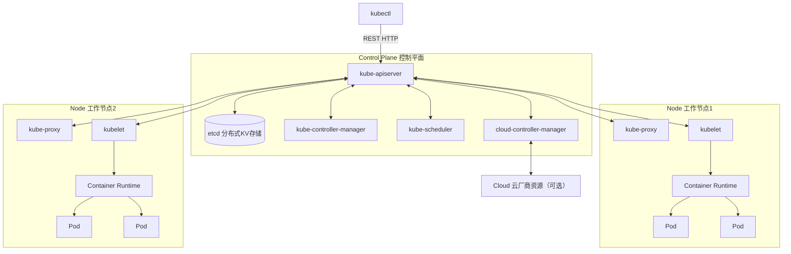
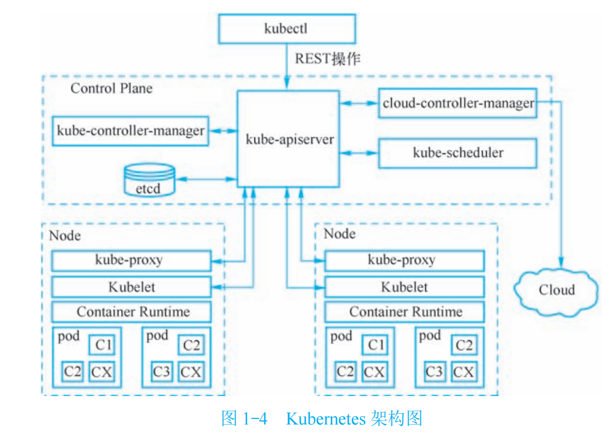
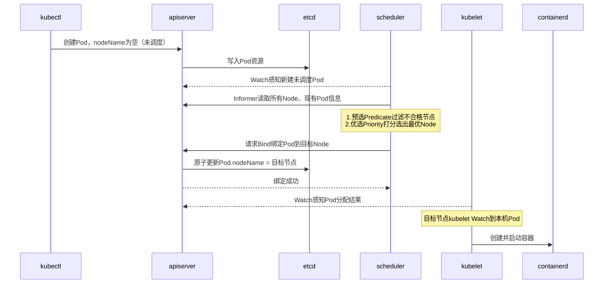

# K8s 核心概念学习笔记
> 学习目标：打通控制平面、工作节点、资源对象完整模型，结合分布式存储管控架构对标理解
> 实战载体：Linux单机 kind 融合集群搭建验证

## 一、集群分层架构（对标 OceanStor FSM/CM + FSA 架构）
### 1. 控制平面 Master 组件合集
#### 1.1 kube-apiserver
- 核心职责:Kubernetes 集群唯一入口网关
  - 集群内所有组件、客户端，所有读写集群资源（Pod/Deployment/Service 等）的操作，只允许和 apiserver 通信，禁止任何组件直连 etcd。
  - 集群唯一可信 API 服务，承载所有 REST 资源操作,接收增删改查（CRUD）各类资源请求；同时提供 Watch 监听机制（分布式系统核心）。
  - 统一完成全套安全管控：认证、鉴权、准入控制。
  - 序列化 / 反序列化资源对象，完成数据校验，合法请求最终持久化存入 etcd。
- 鉴权、准入控制机制
  - 认证 Authentication：确认「你是谁」
  - 鉴权 Authorization：确认「你有没有权限干这件事」
  - 准入控制 Admission Controller：请求写入 etcd 之前的最后一道拦截
- 📝【个人心得/类比】
  - apiserver ≈ 存储管控面统一 HTTP/RPC 网关
  - etcd ≈ 底层配置数据库（CCDB）
  - 上层业务模块（CM/MDC/FSA）不能直连数据库，必须走网关；
  - 网关负责鉴权、参数校验、防止脏数据入库；
  - 网关只提供「业务语义接口」（创建 Pod、扩容副本），不提供「直接修改数据库表 / Key」的底层接口。
#### 1.2 etcd
- 分布式KV存储、Raft协议
  - 持久保存 K8s 全部资源数据（Pod/Deployment/ConfigMap/Secret/Namespace……），集群唯一真实数据源；
  - 提供 强一致读写、MVCC 多版本、事务能力，支撑 apiserver 乐观锁并发控制（resourceVersion）；
  - 提供长连接 Watch 机制，支持客户端订阅 Key 变更（apiserver 依赖它实现集群事件分发）；
  - 依靠 Raft 协议实现多节点副本，保证元数据高可用、不丢失。

- 集群选主、脑裂防护
  - 思想 1：Raft 一致性算法，多数派（Quorum）保障写入安全
  - 思想 2：MVCC 多版本并发控制（乐观锁基础）
  - 思想 3：事件通知机制（Watch）
  - 思想 4：简单分层，聚焦「强一致小型元数据」

- 唯一可信数据源；仅apiserver可直连读写
- 📝【个人心得/类比】
  - etcd 路径只是字符串前缀模拟树形，和 ZK 原生 znode 树形模型本质不同；
  - apiserver 隔离 etcd = CM 网关隔离底层元数据库，同一套分布式管控设计范式；
  - 底层存储实现细节对外屏蔽，上层使用者只操作业务语义资源。

#### 1.3 kube-controller-manager
- 控制器循环调谐模型（期望状态 vs 真实状态）
  - 内部运行一组相互独立的控制器（Controller），所有控制器共享一套与 apiserver 通信的客户端；
  - 每个控制器持续执行 Reconcile（调谐循环）：
    - 从 apiserver 获取【期望状态】（etcd 内保存的蓝图） + 【集群当前真实状态】
    - 计算差值，调用 apiserver API 发起增 / 删 / 改动作，驱动集群向期望状态收敛；
  - 只负责资源管控逻辑，不负责 Pod 调度到哪个节点（调度单独交给 kube-scheduler）；
  - 多 Master 部署场景：依靠 etcd 分布式锁抢主，同一时刻集群只有一份活跃实例，防止多个控制器重复执行操作引发冲突。
- 顶层设计思想
  - 思想 1：期望状态驱动 + 无限循环调谐（整个 K8s 灵魂）
  - 思想 2：控制器职责拆分、单一职责原则
  - 思想 3：无状态设计
  - 思想 4：分布式选主防并发冲突
- 多Master部署：etcd分布式锁抢主机制

- 内置常见控制器简介
- 📝【个人心得/类比】
  - apiserver 作为集群统一数据总线，所有组件状态交互必经此处；依靠 Informer 缓存避免海量重复请求，是集群架构的核心枢纽。
  - 调谐循环表层是循环判断，核心价值是标准化分布式状态收敛模型：不依赖事件、不保存本地状态、具备兜底巡检能力，天然容忍网络抖动、进程重启、意外故障。
  - controller-manager 属于无状态服务，自身不持久化数据；配合 etcd 分布式租约锁完成多实例选主，保证同一时间仅有单一活跃实例执行调度逻辑，避免并发冲突。
  - K8s 控制器基于 client-go 通用框架，采用「Informer 本地缓存 + 工作队列 + 多协程 Worker」模型；框架公共复用，每种控制器独立实现 Reconcile 业务逻辑，Go 语言依靠接口组合而非类继承实现抽象。
  - GMP M:N 调度不是批量阻塞批量释放；IO 阻塞的 G 会和 M 解绑，一旦某个操作系统 M 空闲，立刻承接排队协程，流水线调度；
  - 架构通信划分：海量外部 FSA 客户端南北向流量接入控制总线做收敛；少数 CM 集群内部协商通信采用点对点直连，避免不必要转发延迟；
  - 控制总线划分消息优先级队列，保障集群视图、投票等高优先级指令优先处理；
  - 正常运行场景，总线不会丢弃 FSA 原始心跳报文，依靠本地计时器收敛消息，仅推送状态跃迁事件至 CM；队列溢出丢包属于极端过载降级策略，依托 5s 心跳容错窗口抵御瞬时异常，不作为常规抗风暴方案。
  - K8s 控制平面标准范式：所有管控交互统一经过 kube-apiserver，控制面组件之间不建立点对点 TCP 直连通信；
  - controller-manager、scheduler 选主依靠读写 apiserver 管理的 Lease 租约资源实现，不存在组件之间点对点投票协商；
  - kubelet 节点心跳通过定期 PATCH Lease 对象上报至 apiserver，NodeController 依靠 Watch 感知节点存活状态；相比存储 0.5s 高频心跳场景，K8s 默认心跳周期更长，发生心跳风暴的概率更低；大规模节点集群仍需要做好 apiserver 限流防护；
  - 架构范式区别：存储控制总线偏向「消息转发、流量收敛网关」；apiserver 同时承担统一网关 + 集群唯一状态写入入口，整套系统依靠共享状态 + Watch 事件协同，而非组件之间互发业务消息；
  - 极少数例外：apiserver 主动反向访问 kubelet 获取容器日志；业务 Pod 之间的数据面网络通信，不经过控制平面。
#### 1.4 kube-scheduler
- 核心职责
  - 通过 apiserver Watch 监听所有 未绑定 Node 的 Pod（Pod.spec.nodeName 为空）；
  - 执行一套筛选 + 打分算法，从集群所有 Node 里选出最优节点；
  - 向 apiserver 发起更新请求，把 Pod 绑定到目标 Node（写入 etcd）；
  - 多 Master 部署时，依靠 etcd Lease 租约抢主，同一时间仅一个活跃 scheduler，避免多个调度器争抢同一个 Pod 引发冲突。
- 顶层设计思想
  - 思想 1：两段式调度框架：预选 (Predicate) → 优选 (Priority)
    - 预选：硬性过滤，不满足条件直接淘汰，一票否决；
    - 优选：柔性打分，剩余合格节点计算分数，选出最高分。
    - 先筛掉不能跑的机器，再从能用的机器里挑最合适的。
  - 思想 2：插件化架构
    - 早期：内置一堆硬编码判断；
    - 新版 Scheduler Framework：所有预选、优选逻辑封装成插件，可以启用 / 关闭、自定义扩展。企业场景可以开发自定义调度插件（亲和、反亲和、硬件拓扑、GPU 调度、存储拓扑感知）。
  - 思想 3：无状态设计
    - 自身不缓存长期数据，所有集群视图依靠 Informer 从 apiserver 同步；进程重启后重新 List-Watch 即可恢复调度。
  - 思想 4：抢占机制（高优先级保障）
    - 当高优先级 Pod 没有合适节点可调度时，可以驱逐低优先级 Pod，腾出资源。
    - 类比存储：高优先级业务优先抢占资源。
- Pod绑定调度完整流程

- 预选、优选打分机制
- 📝【个人心得/类比】
  - scheduler 只负责选定节点，不启动容器；决策层和执行层（kubelet）解耦；
  - 两段式「预选过滤 + 优选打分」是通用资源调度经典范式，可以平移到存储、算力平台；
  - Bind 原子绑定防止多个调度器并发争抢同一个 Pod；
  - requests 用于调度预判，limits 用于运行时限流，两者作用需要严格区分；
  - 污点、亲和、抢占机制，实现业务分层、故障域隔离、优先级保障。

### 2. 工作节点 Worker 组件
#### 2.1 kubelet（对标FSA节点本地代理）
- kubelet 与 apiserver 通信方式
- Pod生命周期管理
- 调用容器运行时CRI接口
- 📝【个人心得/类比】

#### 2.2 containerd 容器运行时
- CRI标准作用
- 镜像管理、容器生命周期
- 📝【个人心得/类比】

#### 2.3 kube-proxy
- Service网络代理实现模式（iptables / ipvs）
- 集群内部负载均衡原理
- 📝【个人心得/类比】

### 3. 客户端工具 kubectl & kubeconfig
#### 3.1 kubectl
- 本质：将命令翻译HTTPS请求发送apiserver
- 常用基础命令分类
- 📝【个人心得/类比】

#### 3.2 kubeconfig
- 集群地址、证书、用户、上下文配置
- 多集群切换管理
- 📝【个人心得/类比】

## 二、核心业务资源对象（声明式API核心载体）
### 1. Pod
- Pod是什么；Pod与容器区别
- Pod完整生命周期阶段
- 就绪探针readinessProbe、存活探针livenessProbe
- 📝【个人心得/类比】

### 2. 控制器（自愈能力核心）
#### 2.1 Deployment（无状态服务）
- 副本管理、滚动更新、回滚机制
- 📝【个人心得/类比】

#### 2.2 StatefulSet（有状态服务）
- 稳定网络标识、持久存储有序性
- 适用场景：数据库、GitLab等有状态应用
- 📝【个人心得/类比】

#### 2.3 DaemonSet（对标FSA节点常驻进程）
- 每个节点运行一个Pod，节点代理类服务场景
- 📝【个人心得/类比】

### 3. Service
- 解决Pod IP漂移问题
- Service四种类型 ClusterIP/NodePort/LoadBalancer/ExternalName
- 📝【个人心得/类比】

### 4. 配置资源
#### 4.1 ConfigMap
- 存放普通文本配置，不加密
- 📝【个人心得/类比】

#### 4.2 Secret
- 敏感信息加密存储；镜像拉取密钥、账号密码
- ImagePullSecret使用场景
- 📝【个人心得/类比】

### 5. 存储资源 PV & PVC
- PV：存储资源供给方（对标存储池）
- PVC：业务存储申请方
- 存储回收策略、持久化绑定逻辑
- 📝【个人心得/类比】

### 6. API Group & API Version
- API分组设计初衷
- alpha / beta / stable 版本演进规则
- 📝【个人心得/类比】

## 三、CI/CD高频配套云原生概念
### 1. 容器镜像 & Harbor私有镜像仓库
- Dockerfile基础；镜像分层原理
- 私有仓库镜像推拉鉴权
- 📝【个人心得/类比】

### 2. Namespace
- 集群内资源逻辑隔离
- 资源范围限制、多团队环境划分
- 📝【个人心得/类比】

### 3. 资源配额 requests / limits
- requests：调度预留资源
- limits：资源上限限制，防止进程抢占整机资源
- CI编译场景最佳实践
- 📝【个人心得/类比】

### 4. Job / CronJob 一次性任务
- Job：一次性执行任务（Jenkins动态Agent底层依赖）
- CronJob：定时任务
- 重启策略、任务完成自动回收
- 📝【个人心得/类比】

## 四、权限基础：RBAC & ServiceAccount
- User、ServiceAccount区别
- 角色Role、集群角色ClusterRole、绑定规则
- Jenkins访问K8s集群必备授权配置
- 📝【个人心得/类比】

## 五、学习阶段性实操清单
1. kind 搭建单机融合集群
2. 使用yaml创建Deployment，观察Pod自愈
3. 部署Service实现访问
4. 测试ConfigMap、Secret挂载
5. 搭建简易Harbor，上传自定义编译镜像